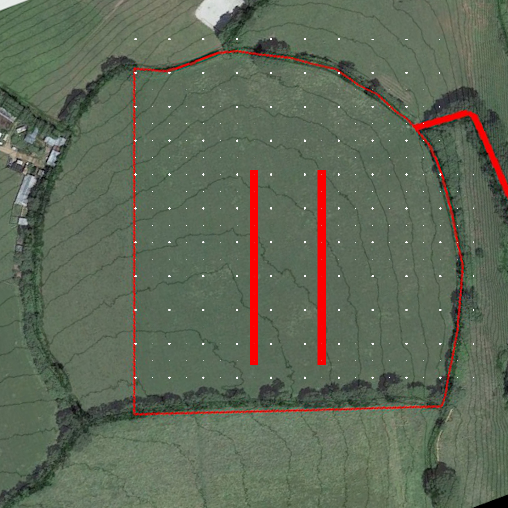

# Project Tree Lanes: Phase 1

## Status

Complete

## Goal

To establish two lanes of trees to act as a wind break and nitrogen fixer and to test the tree planting process

## Overview

- [x] Design layout and select species
- [x] Purchase trees, materials and equipment
- [x] Arrange help
- [x] Plant trees

## Map

## Log