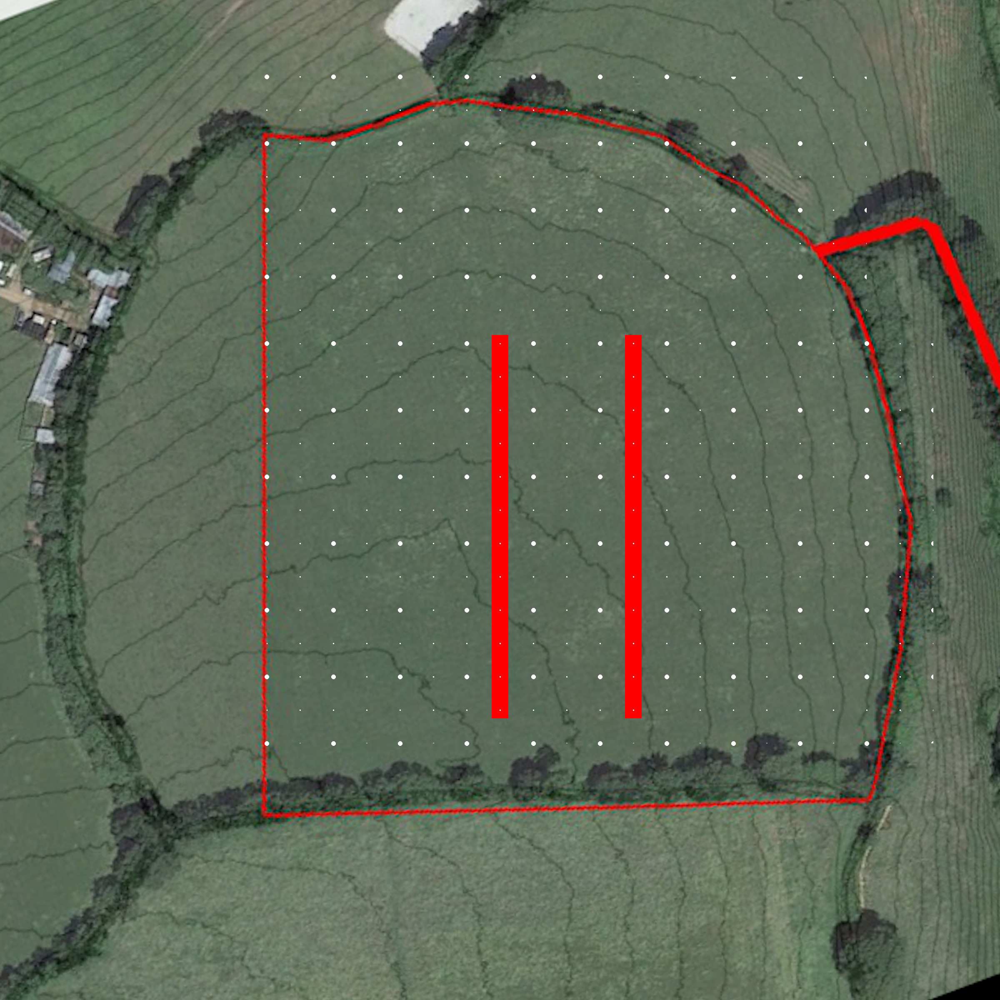

# Project Tree Lanes: Phase 2

## Status

Complete

## Goal

To complete tree lanes buy establishing four more rows.

## Overview

All tree lanes will be coppiced
- greater windbreak in winter
- greater privacy screen
- forage harvesting

- 2 rows black locust
    - very high biomass production
    - nitrogen fixing
    - high protein forage
    - can coppice
- 1 row hazel
    - can coppice
    - useful sticks
    - forage
    - potential for nuts
- 1 row sweet chestnut
    - can coppice
    - fence poles
    - potential for nuts
    - nice trees

- [x] Design layout and select species
- [ ] Purchase trees, materials and equipment
    - [x] Black locust
    - [ ] hazel
    - [ ] sweet chestnut
    - [ ] stakes
    - [ ] guards
    - [ ] mallet
    - [ ] polythene
    - [ ] Mycorrhizal fungi
- [ ] Arrange help
- [ ] Plant trees

## Map

## Log

- ? Order two lanes worth of black locust trees