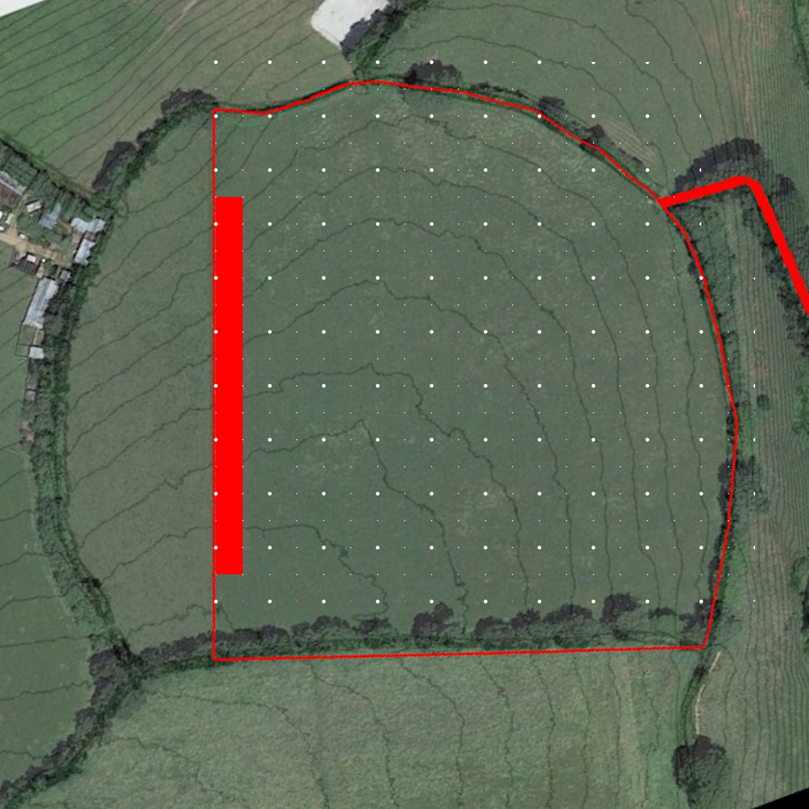

# Project Cobnut Orchard

## Status

Underway

## Goal

To establish an orchard of cider apple trees along the Western boundary of the site

## Overview

I want to achieve

- Greater privacy
- A harvest
- A windbreak
- Allow for future access between my property and the property to the West

## Map

## Detail

Planting pattern:

- 2 rows parallel to boundary fence, staggered
- Fence - 4.5m - Tree - 4.5m - Tree - 1m
- Spacing within rows: 5m
- Stagger offset: 2.5m

## Steps

- [x] Design layout and select species/varieties
- [ ] Purchase trees, materials and equipment
    - [ ] Shelters
    - [ ] Stakes
    - [x] Trees
    - [ ] Black plastic
    - [ ] Mycorrhizal fungi
- [ ] Arrange help
- [ ] Prepare
    - [ ] Cut mulch mats
    - [x] Mark out rows
    - [ ] Deliver to planting sites
        - [ ] Compost
        - [ ] Mulch mat
        - [ ] Stake
        - [ ] Shelter
- [ ] Plant trees

## Log

- 16/11/2020 Initiated project, started spreadhseet to cost: https://docs.google.com/spreadsheets/d/1pb4EYtCwY7o1YLqR3HYny5KzAPGH0lAH_psjrGxfGgk/edit#gid=76235420
- ?/11/2020 Bought stakes and shrub shelters when ordering for South Wood Phase 1 project
- 24/07/2021 change of plan, cider orchard, ordered trees
- ??/07/2021 marked out tree locations with bamboos

