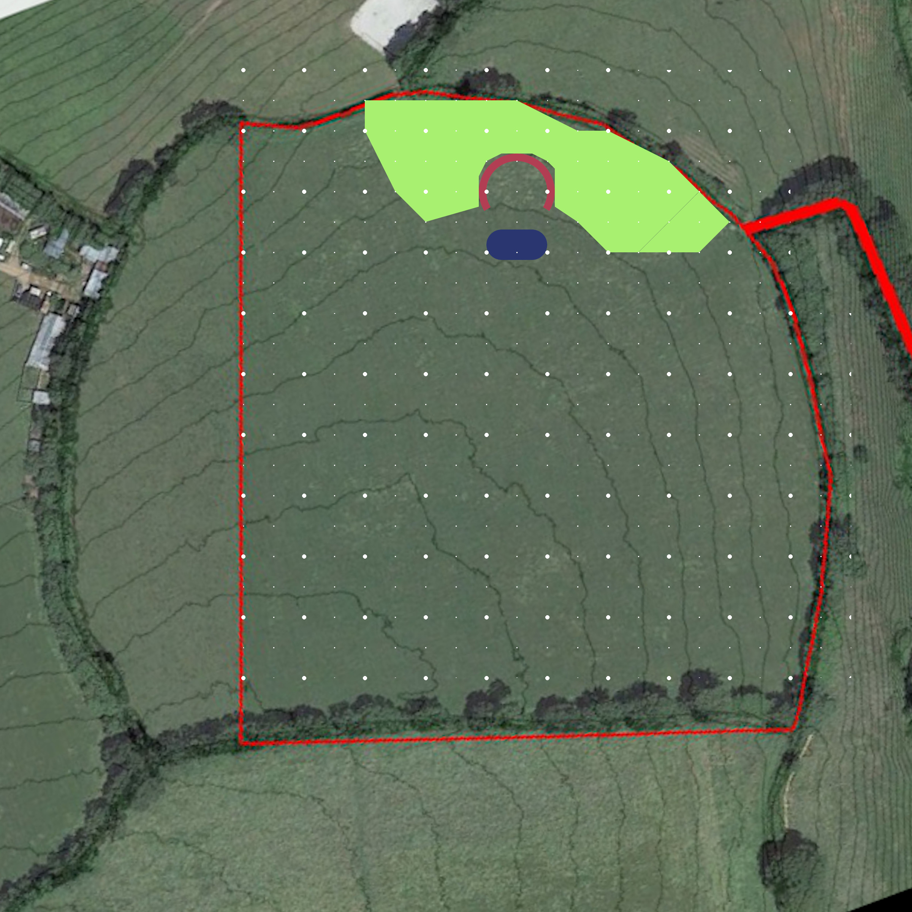

# Project Swimming Pond

## Status

Underway

## Goal

To establish a natural swimming pond and to use the spoil to create a horseshoe embankment for the Garden project

## Overview

By digging a natural swimming pond and using the spoil to create a South-facing horseshoe shaped embankment I can achieve several things:

- A place for swimming
- A habitat for water species of plants and animals
- A sunny sheltered place for the Garden project

## Map

## Steps

- [x] Choose poisition and orientiation
- [x] Basic calculations on size, volume, embankment
- [x] Basic consultation on fasibility
- [x] Detailed volume and shape calculations
    - [x] Sketchup model
    - [x] Spreadheet: Farm - Horseshoe
- [ ] Test trench
- [ ] Detailed plans for overspill
- [ ] Detailed plans for planting area separation
- [ ] Dig
- [ ] Line
- [ ] Fill
- [ ] Plant
- [ ] Pontoon

## Detail

- Detailed design is on Sketchup as Swimming Pond

## Blackboard

- Drainage?
    - Where will water overflowing the pond go?
    - It should not flow into the horseshoe

## Log

- 15/11/2020 Initiated project based on idea from Carl's permaculture friend
- 15/11/2020 Spoke to Jamie Stevens about digging it
    - He has dug poinds before and is currently building a swimming pond
    - Says it's feasible
    - Rough price 10K dug and lined and embankment built
    - SHould be fine to let it fill slowly with rain
- 21/11/2020 Completed detailed volume and shape model on sketchup and spreadsheet