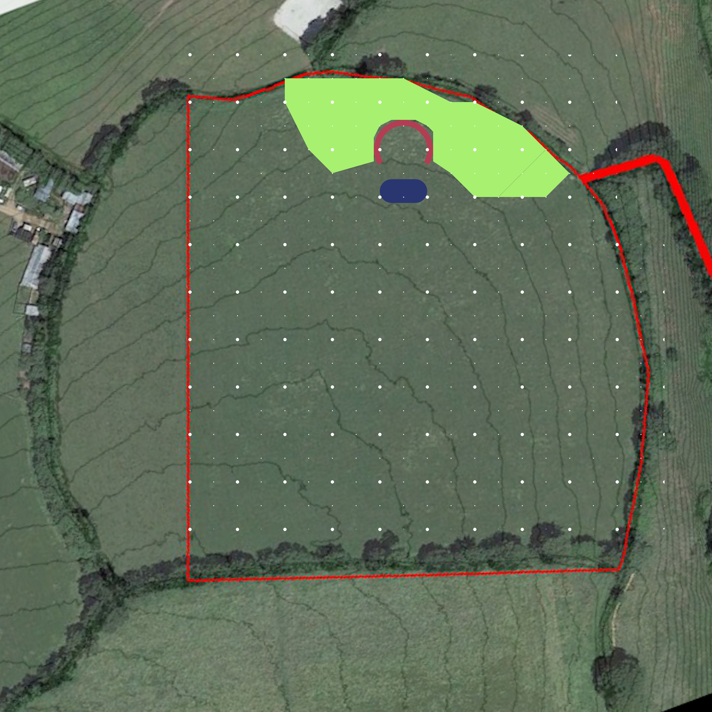

# Project Garden

## Status

Pending

## Goal

To establish a beautiful permaculture garden and socializing space

## Overview

The spoil from the Swimming Pond project will be used to construct a South-facing horseshe shaped embankment which will create a semi enclosed circular space of about 20m diameter. Within this space a garden area can be created to

- Provide flat, warm, sunny, shetered area for socializing
- Provide a microclimate for warmth loving plants
- Provide an area for ornamental planting

## Map

## Steps

- [ ] Complete embankment
- [ ] Sow grass on embankment
- [ ] Pave
    - [ ] Design
    - [ ] Get materials
    - [ ] Lay
- [ ] Planting
    - [ ] Design
    - [ ] Get plants
    - [ ] Plant

## Detail

- The area will be paved in the middle leaving space for planting around the outside
- Behind the embankment (North, East, West) a woodland of Silver Birch and Scots Pine will be estamblished for
    - Beauty
    - Extra shelter
- The embankment will be planted with grass to stabilize it

## Log

- 15/11/2020 Initiated project based on idea from Carl's permaculture friend