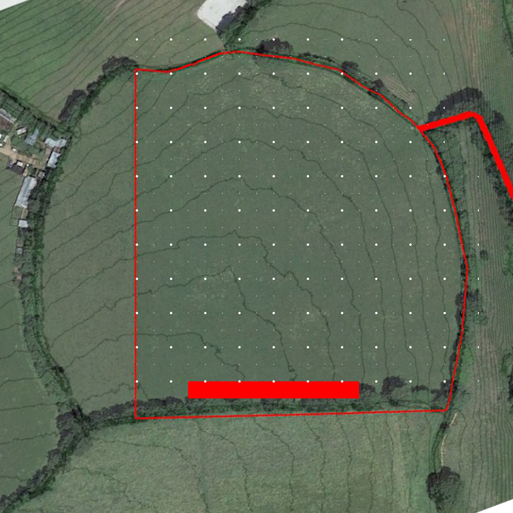

# Project South Wood Pahse 1

## Status

Underway

## Goal

To begin establishing a strip of mixed woodland along the South boundary

## Overview

The South Wood Phase 1 is a 10m x 100m strip of woodland to be planted along the South boundary for:

- Wildlife habitat
- Timber
- Fodder
- Beauty
- Wind break
- Firewood
- Fruit
- Mast

It will consist of mixed native species planted at 2.5m spacing. All the species to be planted are beautiful trees to my mind, but each is also chosen for other attributes:

- Oak
    - Timber
    - Lots of wildlife and fungal assoications
    - Mast
    - Firewood
- Wild Cherry
    - Delicious fruit
    - Bird food
- Walnut
    - Timber
    - Nuts
    - Mast
- Hazel
    - By coppicing can create light openings in the canopy as the woodland matures
    - Nurse tree for timber trees
    - Nuts
    - Mast
    - Poles
    - Firewood
    - Charcoal?
    - Fast growing
    - Fodder
- Scots Pine
    - Timber
    - Firewood
- Cherry plum
    - Fruit
    - Pollenator for plums
- Sweet Chestnut
    - Timber
    - Nuts
    - Mast
- Crab Apple
    - Pollenator for apples
    - Fruit
    - Bird food
- Birch
    - Fast growing
    - Timber
- Spindleberry
    - Small so creates openings
- Larch
    - Timber
    - Firewood

## Map

## Steps

- [x] Finalize tree number and selection
- [x] Order trees and materials
- [ ] Secure two helpers
    - [x] Tom - canceled
    - [x] Silas - canceled
    - [x] Gill
    - [x] Nick
- [ ] Preparation
    - [x] Mark out area
    - [x] Cut plastic mulch mats
    - [x] Deliver compost to planting sites
        - [x] Square 1
        - [x] Square 2
        - [x] Square 3
        - [x] Square 4
        - [x] Square 5
        - [x] Square 6
        - [x] Square 7
        - [x] Square 8
        - [x] Square 9
        - [x] Square 10
    - [ ] Deliver stakes to planting sites
        - [ ] Square 1
        - [ ] Square 2
        - [ ] Square 3
        - [ ] Square 4
        - [ ] Square 5
        - [ ] Square 6
        - [ ] Square 7
        - [ ] Square 8
        - [ ] Square 9
        - [ ] Square 10
    - [ ] Deliver shelters to planting sites
        - [ ] Square 1
        - [ ] Square 2
        - [ ] Square 3
        - [ ] Square 4
        - [ ] Square 5
        - [ ] Square 6
        - [ ] Square 7
        - [ ] Square 8
        - [ ] Square 9
        - [ ] Square 10

## Log

- ?/11/2020 Initiated project after successful completion of Tree Lanes Phase 1
- ?/11/2020 Created spredsheet to price up project  See South Wood Pahse one at https://docs.google.com/spreadsheets/d/1pb4EYtCwY7o1YLqR3HYny5KzAPGH0lAH_psjrGxfGgk/edit#gid=1808308307
- ?/11/2020 Ordered trees and materials
- 20/11/2020 Trees to be delivered on 10/12
- 20/11/2020 Asked Tom and Silas for help. Tom can do 12th. No reply yet from Silas.
- 21/11/2020 Black plastic arriving at field 26-27/11
- 27/11/2020 platic mulch mats cut out
- 10/12/2020 measured and marked out area, began delivering materials
- 15/12/2020 finished delivering mulch mats and compost to site
- 18/12/2020 trees stakes and shelters arrived on site
