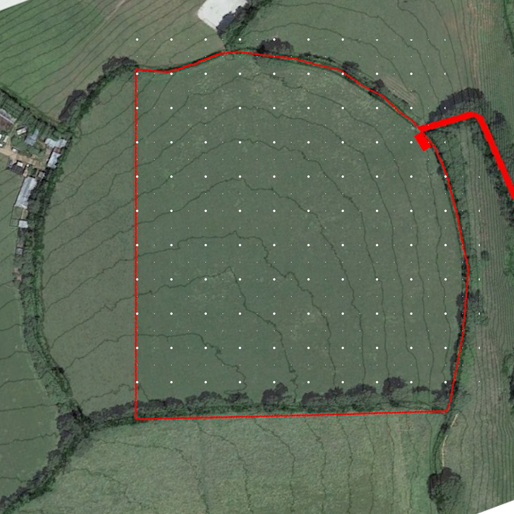

# Project Accomodation Phase 1

## Status

Exploratory

## Goal

To establish the capability to shelter and sleep at the field. This does not inlcude staying multiple nights, washing or cooking but does include a warm, dry place with a bed, a desk, a chair, a wood burining stove, windows and device charging capability.

## Overview

## Map

## Steps

- [x] Finalize location
    - See map
    - Mostly hidden from neighbors
    - Nice view north
    - Good view of field south and west
    - Sun on south side
    - Not in pasture lane
    - Somewhat sheltered
- [ ] Decide on structure
    - [ ] Is a shephers hut big enough?
        - [ ] View one
            - [ ] Blackdown Shepherds huts should be open from 02/12
- [ ] Source structure
- [ ] Order
- [ ] Receive
- [ ] Build?

## Blackboard

- https://www.blackdownshepherdhuts.co.uk/
    - Looks expensive but nice
    - Can do everything I would want
        - Custom windows including large panes and double glazing
        - Internal width 207cm
        - Internal height: 1990 (side) - 2300 (middle)
        - Insulation: 5cm sheeps wool
        - Can do solar charging
        - Can do wood stove
        - Can do side awning but then you can't open side doors or windows
        - Deliver and place

## Log

- ?/11/2020 Identified location for accomodation (see map)
- ?/11/2020 Initiated project
- 20/11/2020 Called blackdownshepherdhuts for info on their offering. See blackboard.