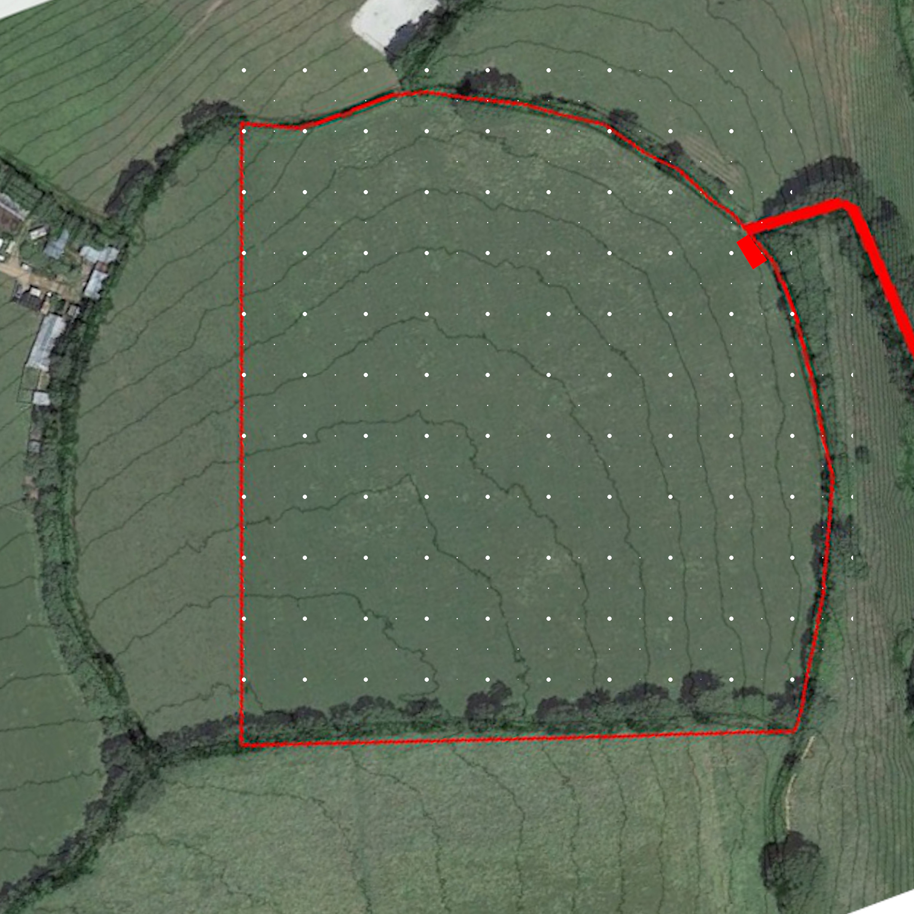

# Project Livestock

## Status

Exploratory

## Goal

To utilize livestock for soil health, grass management, carbon sequestration and food production

## Map

## Steps

- [ ] Learn
    - [ ] Read a book
        - [ ] Sheep
        - [ ] Beef Cattle
        - [ ] Geese
        - [ ] Pigs
        - [ ] Broilers
        - [ ] Layers
- [ ] Experience
    - [ ] Get hands on experience with
        - [ ] Sheep
        - [ ] Beef Cattle
        - [ ] Geese
        - [ ] Pigs
        - [ ] Broilers
        - [ ] Layers
- [ ] Connect
    - [ ] Make a connection with an expert in
        - [x] Cattle (Sonia)
        - [x] Sheep (Paul, Danny)
        - [ ] Geese
        - [ ] Pigs
        - [ ] Broilers
        - [ ] Layers
- [ ] Infrastructure
    - [ ] Tree lanes
        - [x] Phase 1
        - [ ] Phase 2
        - [ ] Phase 3
    - [ ] Water
        - [x] Collection
        - [ ] Distribution
            - [ ] Phase 1
            - [ ] Phase 2
            - [ ] Phase 3
        - [ ] Drinkers
            - [ ] Cattle
            - [ ] Sheep
    - [ ] Boundary fence
    - [ ] Mobile electric fencing
    - [ ] Barn

## Blackboard

Latest thinking:
- Useful information if I need to build a business model for planning permission, potential for ~£200K turnover in beef on 9 acres: https://johnkempf.com/yield-six-thousand-pounds-of-beef-per-acre/
- Borrowing livestock would be a great start. Needs
    - Temp electric fencing
    - Water distribution
    - Drinkers
- Very small beef cattle herd grazed along pasture lanes
- Kept to small paddock with mobile electric fencing
- Paddock moved daily or so
- Water brought to paddock via pipes, gravity
- Cut hay and tree hay and store in barn for winter feed?
- Pay for slaughter+butcher
- Store meat in freezer in carport. Not big enough.

- Beef Cattle
    - From sonia
        - risk of 'poaching' in wet weather they can cause long term damage to the soil
        - You will need some winter shelter for them - could be a polytunnel
    - Will need hay in the winter
- Sheep
    - They escape easily
    - Feet need regular inspecting
    - Need regular de-worming with stuff that is bad for soil life
- Geese
    - Eat mainly grass
    - Very hard to pluck
- Broiler Chickens
    - Chicks needs heated dry pens called brooders before they can go outside
- Laying Hens

## Log

- 21/11/2020 Emailed Haye Farm to ask if I can volunteer there. They do rotational grazing of beef, sheep and poultry nearby
- ? Much later  - no reply from Haye farm.